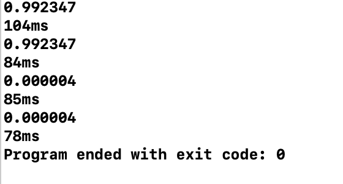

#CS205 C/ C++ Programming - Project 2
***
Name: Zhang Jiayi 

SID: 11610231

##Part 1 - Analysis
A simple CNN is a series of layers, and each CNN layer converts one quantity to another using a differentiable function. We use three main types of layers to build the CNN structure: the Convolutional Layer, the Pooling Layer, and the Fully-Connected Layer. We will stack these layers to build a complete CNN structure.


* Input will hold the original pixel value of the image.
* The CONV layer computes the output of the neurons connected to the input local area, each of which computes their weights and the dot product between the small areas they are connected to in the input.
* The POOL layer will perform a down-sampling operation along the spatial dimensions (width, height) 
* The FC layer calculates the category score

## Part2 - Result & Verification
The convolutional layer for 3x3 kernels is correctly implemented. It should support stride=1 and stride=2 as well as padding=1.
```
conv_param conv_params[3] = {
    {1, 2, 3, 3, 16, conv0_weight, conv0_bias},
    {0, 1, 3, 16, 32, conv1_weight, conv1_bias},
    {1, 2, 3, 32, 32, conv2_weight, conv2_bias}
};
```
The program can output the confidence scores correctly for images.

I optimized the matrix muplication: alternate cycle order, having changed the original IJK order to IKJ:

